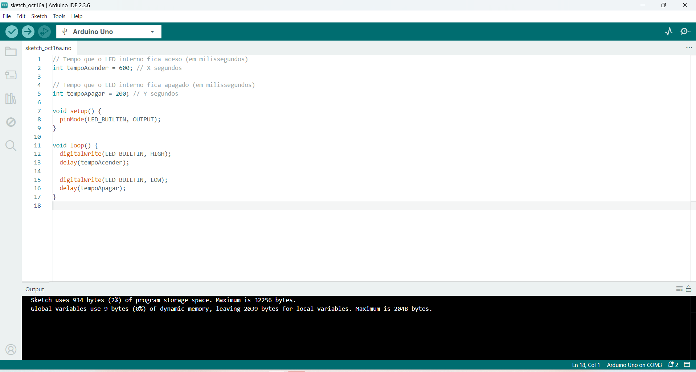
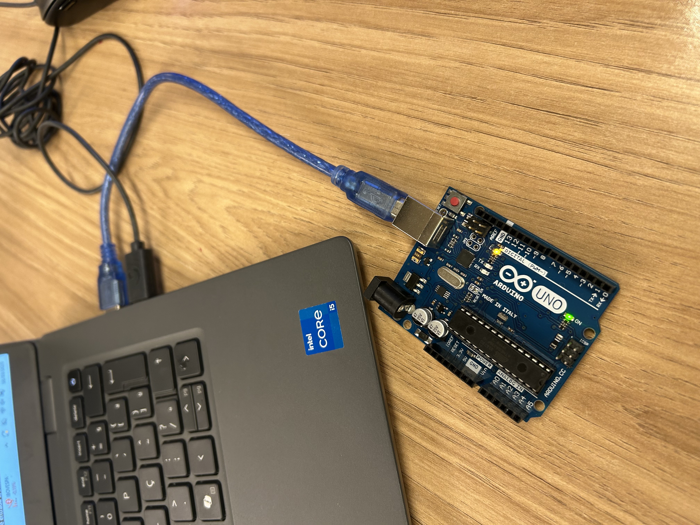
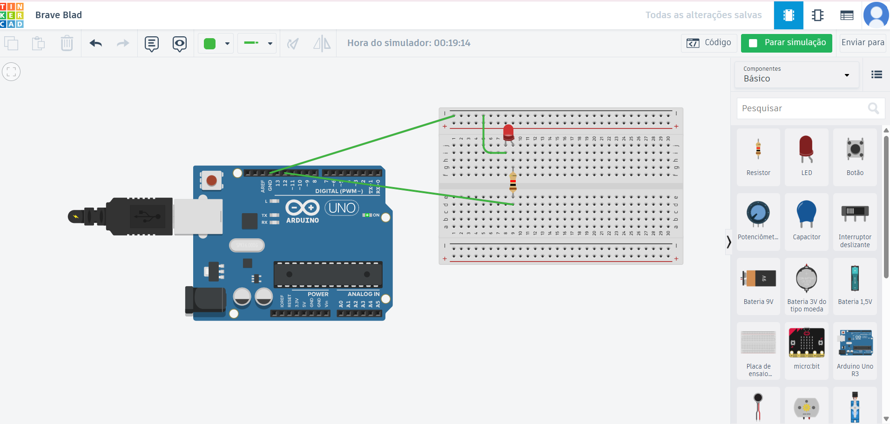

# Ponderada - Semana 01

## Parte 01: Blink LED Interno

Evidências da execução do **LED interno do Arduino**:  
- Código utilizado no IDE  
- LED aceso no Arduino  
- Vídeo demonstrando o funcionamento

  
  
<video controls src="assets/video-led-ligado.mp4" title="LED Ligado"></video>

## Parte 02: Simulando Blink Externo

Evidências da **simulação de LED externo no TinkerCad**:  
- Protoboard, LED e resistor conectados  
- Código e execução sem erros  
- Projeto publicado no GitHub

  

[Link do projeto no Tinkercad](https://www.tinkercad.com/things/d0EFkrjnstS/editel?returnTo=%2Fdashboard%2Fdesigns%2Fcircuits&sharecode=ErMIxDSmDcH8OgxXiy2VDw8EUhbafbSkIGiJgShhnZ0)
