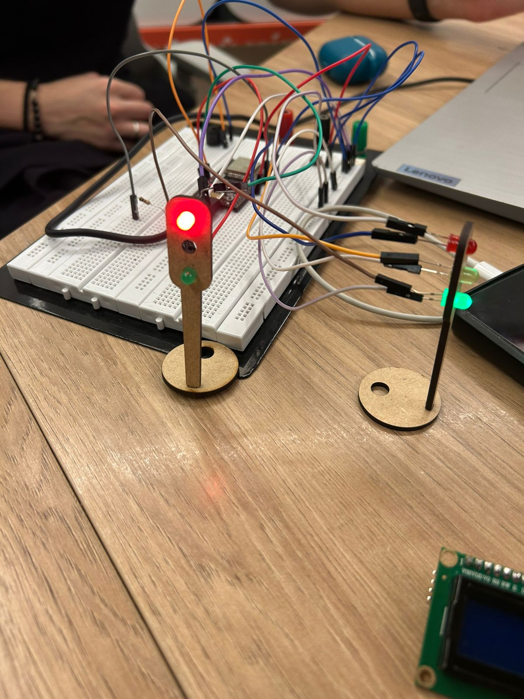
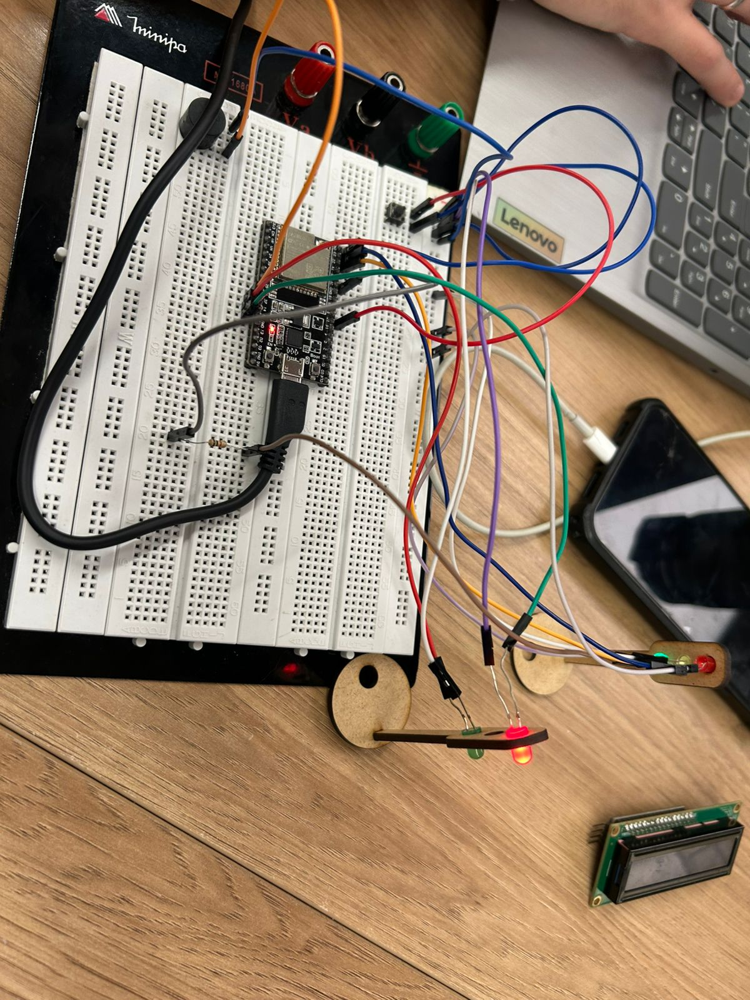

# 🚦 Projeto do Semáforo Offline

Este repositório armazena os artefatos (mídia e código) de um protótipo de semáforo de pedestres. O sistema é gerenciado por um microcontrolador (ESP32) e simula o fluxo de trânsito, incluindo LEDs para carros e pedestres, um botão de solicitação e um **Buzzer** como recurso de acessibilidade auditiva durante a permissão de travessia.

---

## Análise de Pares

O protótipo foi revisado por Nicole e João, que focaram em critérios de robustez, eficiência da lógica e clareza da documentação.

| Critério de Análise | Peso (%) | Nota de Nicole | Nota de João |
| :--- | :---: | :---: | :---: |
| **Eficiência da Lógica** (Transições e Tempos) | 40% | 9,5 | 10,0 |
| **Integração de Hardware** (Atuadores e Sensor) | 30% | 8,5 | 9,0 |
| **Qualidade do Código** (Legibilidade e Boas Práticas) | 20% | 9,0 | 9,5 |
| **Qualidade da Documentação (README)** | 10% | 8,0 | 8,0 |
| **Média Final** | **100%** | **9,0** | **9,5** |

---

## Sequência de Operação (vdopond1.mp4)

O vídeo de demonstração exibe o ciclo operacional completo do sistema.

**Etapas do Processo:**

1.  **Modo de Espera (Tráfego Liberado):** Inicialmente, o sinal favorece os veículos (LED Verde Carro, Pino 12, ativo). O sistema monitora o botão de pedestres.
2.  **Solicitação de Travessia:** Quando o botão (Pino 17) é pressionado, o sistema aguarda um intervalo de segurança (30s) antes de iniciar a transição.
3.  **Alerta Inicial (Pedestre):** O LED Vermelho do Pedestre (Pino 21) pisca, sinalizando o início da mudança.
4.  **Atenção (Veículos):** O sinal verde (Pino 12) é desativado e o LED Amarelo (Pino 22) acende por 7 segundos.
5.  **Alerta de Parada (Veículos):** Os LEDs Amarelo (22) e Verde (12) piscam simultaneamente, indicando a iminente parada total.
6.  **Travessia Liberada (Pedestre):** O sinal de veículos fica Vermelho (Pino 14) e o sinal de pedestres fica Verde (Pino 23), permitindo a passagem por 7 segundos.
7.  **Aviso de Encerramento (Pedestre):** O LED Verde (Pino 23) pisca, e o **Buzzer (Pino 27) soa de forma intermitente**, indicando o fim do tempo de travessia.
8.  **Retorno ao Modo de Espera:** O ciclo é concluído e o sistema retorna à Etapa 1, liberando o tráfego de veículos.

---

## Mídia do Projeto

Imagens e vídeos que documentam a montagem e o funcionamento.

**Foto 1: Visão Completa da Protoboard**


**Foto 2: Foco nos Componentes**


**Demonstração em Vídeo:**
[Link para o primeiro vídeo da simulação](assets/vdopond1.mp4)

[Link para o segundo vídeo da simulação](assets/videosemaforo.mp4)


---

## Código-Fonte

O script abaixo controla toda a lógica de transição, temporização e o acionamento dos atuadores (LEDs e **Buzzer** no Pino 27).

```c
#define but 17
unsigned long changetime;
int cont;

void setup() {
  Serial.begin(115200);
  pinMode(12, OUTPUT); // LED Verde Carro
  pinMode(14, OUTPUT); // LED Vermelho Carro
  pinMode(but, INPUT_PULLUP); // Botão do Pedestre
  pinMode(21, OUTPUT); // LED Vermelho Pedestre
  pinMode(22, OUTPUT); // LED Amarelo Carro
  pinMode(23, OUTPUT); // LED Verde Pedestre
  pinMode(27, OUTPUT); // Buzzer
}

void loop() {
  // Configuração Padrão: Carros Liberados / Pedestres Fechados
  digitalWrite(14, 0); // Vermelho Carro OFF
  digitalWrite(23, 0); // Verde Pedestre OFF
  digitalWrite(21, 1); // Vermelho Pedestre ON
  digitalWrite(12, 1); // Verde Carro ON
  Serial.println("Nao atravesse!!");
  delay(5000); // 5s iniciais de espera

  // Contagem regressiva (simulada via Serial)
  cont = 31;
  for(int j = 0; j < 30; j++){
    cont--;
    Serial.println(cont);
    delay(800);
  }
  delay(500);
  Serial.println("Aperte o botão para atravessar");

  // Espera o acionamento do botão do pedestre
  while(true){
    int leitura = digitalRead(but);
    // Verifica se o botão foi pressionado (LOW) e se o tempo de espera (30s) passou
    if (leitura == LOW && (millis() - changetime) > 30000){
      time(); // Inicia o ciclo de travessia
    }
  }
  delay(2000);
}

void time() {
  // 1. Transição: Pisca o LED Verde do Carro
  for(int i = 0; i < 6; i++){
    digitalWrite(21, 0); // Pisca Vermelho Pedestre (o Vermelho Pedestre pisca antes do Amarelo Carro)
    delay(500);
    digitalWrite(21, 1);
    delay(500);
  }
  digitalWrite(21, 0); // Vermelho Pedestre OFF

  // 2. Carro Amarelo
  digitalWrite(22, 1); // Amarelo Carro ON
  delay(7000); // 7s de Amarelo

  // 3. Transição: Pisca o LED Amarelo do Carro
  for(int i = 0; i < 6; i++){
    digitalWrite(22, 0); // Amarelo Carro OFF/ON
    digitalWrite(12, 0); // Verde Carro OFF/ON
    delay(500);
    digitalWrite(22, 1);
    digitalWrite(12, 1);
    delay(500);
  }
  digitalWrite(22, 0); // Amarelo Carro OFF
  digitalWrite(12, 0); // Verde Carro OFF

  // 4. Travessia Permitida: Pedestre Verde / Carro Vermelho
  digitalWrite(23, 1); // Verde Pedestre ON
  digitalWrite(14, 1); // Vermelho Carro ON
  delay(7000); // 7s de Travessia
  // (Neste ponto, o buzzer deveria ser ligado se fosse uma lógica mais detalhada)

  // 5. Alerta de Fechamento: Pisca o LED Verde do Pedestre E O BUZZER
  for(int i = 0; i < 6; i++){
    digitalWrite(23, 0); // Verde Pedestre OFF
    digitalWrite(14, 0); // Vermelho Carro OFF
    digitalWrite(27, 1); // Buzzer ON (Alerta de fechamento)
    delay(500);
    digitalWrite(23, 1); // Verde Pedestre ON
    digitalWrite(14, 1); // Vermelho Carro ON
    digitalWrite(27, 0); // Buzzer OFF
    delay(500);
  }
  
  loop(); // Retorna ao estado inicial (Carro Verde)
}